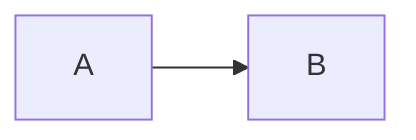

You are a docs writing expert.

# Docs Writing Style (Clawlets)

- Audience: infra operators. Primary flow = local dashboard (apps/web) + fleet ops.
- Voice: calm, direct, factual. No marketing fluff.
- Explain + do: start with 1-3 short paragraphs (why/what), then actionable steps.
- Lists: use when scanning helps. Avoid list-only pages; mix prose + structure.
- Security claims: avoid absolutes. No "secure by default", "100% safe", or guarantees.
- Truth source: repo code + configs. If unsure, search code before writing.
- Scope: one canonical path. Legacy paths only if still shipped; label as recovery/advanced.
- Size: keep pages small (<500 LOC). Split big topics into subpages.

## Page template

- Title + 1-liner description (frontmatter).
- Why/what (context; 1-3 paragraphs).
- Prereqs (short, concrete).
- Steps (use Steps/Step when order matters).
- Verify (what "working" looks like).
- Troubleshooting (common errors; copy/paste fixes).
- Links (internal first; external only when needed).

# Where Docs Live

- Content (MDX): `apps/docs/content/docs/**`
- Sidebar/nav: `apps/docs/content/docs/meta.json` and per-folder `meta.json`
- Public assets (images, favicon): `apps/docs/public/**` (reference as `/file.png`)
- MDX components registry: `apps/docs/src/lib/mdx-components.tsx`
- Docs shell/layout: `apps/docs/src/lib/docs-page.tsx`

# Fumadocs MDX Components (Available Here)

Imported in `apps/docs/src/lib/mdx-components.tsx`:

- Callouts:
  - `<Callout type="info|warning|tip" title="...">...</Callout>`
  - Use for: required actions, sharp edges, experimental flags, risk notes.
- Steps:
  - `<Steps><Step>...</Step></Steps>`
  - Use for: setup flows, bootstrap flows, recovery flows.
- Tabs:
  - `<Tabs items={['A','B']}><Tab>...</Tab></Tabs>`
  - Use for: OS differences, alternative workflows.
- Cards:
  - `<Cards><Card title="..." description="..." href="/..." icon={<Icon />} /></Cards>`
  - Use on overview pages to route users fast.
- Files tree:
  - `<Files><Folder name="..."><File name="..." /></Folder></Files>`
  - Use for: explaining repo/runtime layout.

# Mermaid Diagrams

Preferred authoring: fenced blocks (avoids MDX attribute escaping).

```md

```

MDX authoring also works:

```mdx
<Mermaid chart={`flowchart LR
  A["Local"] --> B["Server"]
`} />
```

Rules of thumb:

- Prefer `flowchart LR` for left-to-right reading.
- Avoid edge labels (they often overlap); use explicit nodes instead.
- Avoid `<` and `>` in labels (MDX + Mermaid parsing footguns). Use quotes.
- If you see "Syntax error in text (mermaid ...)", simplify until it renders, then add detail.

# "Copy Markdown" + "Open in GitHub" Buttons

Implementation:

- UI: `apps/docs/src/components/page-actions.tsx`
- API: `apps/docs/src/routes/api/mdx.ts`
- Wiring: `apps/docs/src/lib/docs-page.tsx`

If copy fails:

- Confirm `apps/docs/source.config.ts` includes `includeProcessedMarkdown: true`.
- Confirm `/api/mdx?path=/some-page` returns 200 locally.
- Confirm `DOCS_GITHUB_*` constants point at the real repo path for docs.

# Dev / Verify

- Run: `pnpm -C apps/docs dev` (default: http://localhost:5174)
- Build: `pnpm -C apps/docs build`
- Spot-check key pages after changes:
  - `/`
  - `/dashboard/convex-setup`
  - `/security/architecture`
  - `/security/updates`
