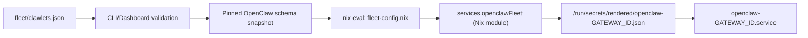

Clawlets ultimately runs **OpenClaw** on servers. The goal of the "typed surfaces" is to
make the *common* parts of OpenClaw configuration easy to set, validate, and edit in the
dashboard/CLI, while still keeping an escape hatch for advanced keys.

In practice, each gateway has two layers.

Gateways are host-scoped in `fleet/clawlets.json`:

- `hosts.<host>.gateways.<gatewayId>`

- **Typed surfaces** (first-class keys in `fleet/clawlets.json`)
- **OpenClaw passthrough** (`hosts.<host>.gateways.<gatewayId>.openclaw`) for advanced/edge cases

In addition, each gateway has a **profile** (`hosts.<host>.gateways.<gatewayId>.profile`) that controls the
*Nix/runtime* side (secret injection, workspace seeding, resources). The profile is not
"OpenClaw config" itself, but it affects how the service runs.

## What is typed vs passthrough

Typed surfaces (preferred):

- `hosts.<host>.gateways.<gatewayId>.channels`
- `hosts.<host>.gateways.<gatewayId>.agents`
- `hosts.<host>.gateways.<gatewayId>.hooks`
- `hosts.<host>.gateways.<gatewayId>.skills`
- `hosts.<host>.gateways.<gatewayId>.plugins`

OpenClaw passthrough (advanced):

- `hosts.<host>.gateways.<gatewayId>.openclaw` (raw JSON object merged into the OpenClaw root config)

<Callout type="warning" title="Do not nest typed surfaces under openclaw.*">
  Do not set <code>hosts.&lt;host&gt;.gateways.&lt;gatewayId&gt;.openclaw.channels</code> (or agents/hooks/skills/plugins).
  Clawlets rejects that layout to avoid ambiguity. Put those keys at the top level under the gateway.
</Callout>

## OpenClaw schema validation (pinned)

Clawlets validates the **effective** OpenClaw config for each gateway against a **pinned
schema snapshot** committed in the repo:

- `packages/core/src/generated/openclaw-config.schema.json`
- `packages/core/src/generated/openclaw-config.types.ts`

This keeps typed surfaces and passthrough aligned with upstream.

Update the snapshot (contributors):

```bash
nix run .#update-openclaw-schema
```

## The gateway profile (runtime surface)

`hosts.<host>.gateways.<gatewayId>.profile` configures runtime behavior that is enforced by the Nix layer:

- secret injection inputs: `profile.secretEnv`, `profile.secretFiles`
- least-privilege env injection: `profile.secretEnvAllowlist`
- workspace layout/seeding: `profile.workspace.seedDir`
- systemd resources: `profile.resources.memoryMax`, `profile.resources.cpuQuota`, ...

These keys are validated twice:

1. JSON validation by the CLI/dashboard
2. Nix option typing/assertions during deploy

## How Nix consumes this (high-level)

At deploy time, Clawlets evaluates a small Nix expression that converts `fleet/clawlets.json`
into typed Nix module inputs (gateway profiles, secret wiring, deterministic gateway order).

Then the `openclawFleet` module composes each gateway's final OpenClaw config and renders it to
disk so the service consumes one validated JSON file.



## Merge order (what wins)

For each gateway, the OpenClaw root config is built in Nix:

1. **Clawlets base config** (managed defaults + secret injection helpers)
2. **User config** (OpenClaw passthrough + typed surfaces mapped into OpenClaw)
3. **Clawlets invariants** (gateway bind/port/auth, workspace path, bootstrap policy)

This keeps operations deterministic while still letting you configure most of OpenClaw.

## Example (typed + passthrough)

```json
{
  "hosts": {
    "openclaw-fleet-host": {
      "gatewaysOrder": ["maren"],
      "gateways": {
        "maren": {
          "channels": {
            "discord": { "enabled": true, "token": "${DISCORD_BOT_TOKEN}" }
          },
          "agents": {
            "defaults": { "model": { "primary": "zai/glm-4.7" } }
          },
          "skills": {
            "allowBundled": ["brave-search"]
          },
          "openclaw": {
            "logging": { "level": "info" }
          }
        }
      }
    }
  }
}
```

In this example:

- `channels`/`agents`/`skills` are first-class (typed) inputs.
- `openclaw.logging` is passthrough because it's not a Clawlets surface.

## Where this lives in the repo (for contributors)

If you're changing the config model, these files are the main touch points:

- `nix/lib/fleet-config.nix` (maps JSON config → Nix module inputs)
- `nix/modules/openclaw-fleet/impl/gateway-config.nix` (builds final OpenClaw config per gateway)
- `packages/core/src/lib/clawlets-config.ts` (runtime schema + legacy layout rejection)
