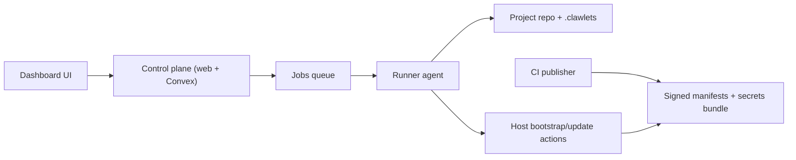

Clawlets separates control-plane orchestration from execution. The dashboard tracks
metadata and queues work. A runner with repo access executes Git, secrets, and host
operations.

Use this as the canonical operator flow page. Other pages link here for context, then
go deeper on specific tasks.

## What runs where

- Control plane (`apps/web` + Convex): project state, run timeline, queue, metadata
- Runner agent (`clawlets runner start ...`): config writes, secrets flow, deploy commands
- Host updater: pull signed release pointer + manifest, verify, switch by store path

## Stage 1: First login and project creation

1. Sign in at `http://localhost:3000`.
2. Create project (or import) and set runner repo path (default: `~/.clawlets/projects/<slug>`).
3. Start runner with the token/command shown in the dialog.
4. Wait for project init/import run to finish.
5. Open host setup at `/<projectSlug>/hosts/<host>/setup`.

For UI details: [First login](/dashboard/first-login).

## Stage 2: Host setup wizard (Day 0 infra)

Route: `/<projectSlug>/hosts/<host>/setup`

<Callout type="warning" title="Connect runner first">
  Stage 2 starts with a required **Connect Runner** step. Until a fresh runner heartbeat
  and repo probe succeed, all other setup steps remain locked.
  See [Runner Agent](/operations/runner-agent).
</Callout>

Step order and gating:

1. `Connect Runner` (`runner`): requires fresh online runner + successful repo probe.
2. `Server Access` (`connection`): requires `provisioning.adminCidr` and at least one `fleet.sshAuthorizedKeys` entry.
3. `Provider Tokens` (`creds`): requires `HCLOUD_TOKEN`, `GITHUB_TOKEN`, and `SOPS_AGE_KEY_FILE`.
4. `Server Passwords` (`secrets`): requires successful run `secrets_verify_bootstrap`.
5. `Install Server` (`deploy`): requires successful bootstrap run (`bootstrap`).
6. `Secure and Verify` (`verify`): optional post-bootstrap hardening checklist.

Canonical provider guidance:

- [Hetzner (recommended)](/providers/hetzner)

## Stage 3: OpenClaw setup wizard (Day X app layer)

Route: `/<projectSlug>/hosts/<host>/openclaw-setup`

Step order and gating:

1. `Enable OpenClaw` (`enable`)
2. `Configure Gateway` (`gateway`) after OpenClaw is enabled
3. `App Secrets` (`secrets`) after at least one gateway exists and verify run `secrets_verify_openclaw` succeeds
4. `Deploy Update` (`deploy`) after successful run `server_update_apply`

For full behavior: [OpenClaw setup](/dashboard/openclaw-setup).

## Stage 4: Day-2 update loop

1. Update config/secrets in repo.
2. Publish signed manifest (+ secrets bundle when digest changes).
3. Run host update apply now, or wait for host self-update timer.
4. Validate run history and host status.

Details: [Deploy](/operations/deploy), [Deployment scenarios](/operations/deployment-scenarios), [Secrets](/security/secrets).

## Verify by stage

- Stage 1 complete: project status is `ready`; init/import run is successful.
- Stage 2 complete: latest `bootstrap` run for host is `succeeded`.
- Stage 3 complete: latest `server_update_apply` run for host is `succeeded` after OpenClaw changes.
- Stage 4 healthy: repeated update applies succeed with no secrets digest or signature failures.

## Troubleshooting map

- Setup step locked: check previous gate condition in the step list above.
- Deploy creds save prompts/fails: verify runner online and local submit settings; see [Deploy credentials](/dashboard/deploy-credentials).
- OpenClaw secrets step blocked: run openclaw-scope verify and resolve missing wiring.
- Update apply fails: check signature/secrets digest conditions in [Deploy](/operations/deploy) and [Updates](/security/updates).
