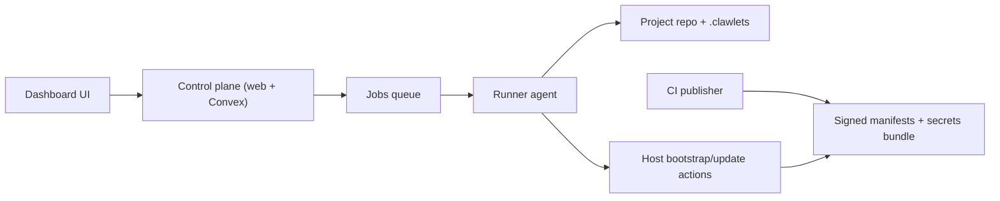

Model C splits the control plane from execution. The dashboard tracks metadata and
queues work. A runner with repo access performs Git, secrets, and host operations.

Use this page as the canonical operator path. Other pages in Dashboard, Operations,
and Security link here for context, then go deep on one part.

## What you run where

- Control plane (`apps/web` + Convex): project state, run timeline, queue, metadata
- Runner agent (`clawlets runner start ...`): config writes, secrets flow, deploy commands
- Host updater: pull signed release pointer + manifest, verify, switch by store path

## Stage 1: First login and project creation

1. Sign in at `http://localhost:3000`.
2. Create project and choose repo/template source.
3. Wait for project init run to finish.
4. Open host setup at `/<projectSlug>/hosts/<host>/setup`.

For UI details: [First login](/dashboard/first-login).

## Stage 2: Host setup wizard (Day 0 infra)

Route: `/<projectSlug>/hosts/<host>/setup`

Step order and gating:

1. `Server Access` (`connection`): requires `provisioning.adminCidr` + at least one `fleet.sshAuthorizedKeys` entry.
2. `Provider Tokens` (`creds`): requires `SOPS_AGE_KEY_FILE` and provider creds (`HCLOUD_TOKEN` or AWS key pair).
3. `Server Passwords` (`secrets`): requires successful run `secrets_verify_bootstrap`.
4. `Install Server` (`deploy`): requires successful bootstrap run (`bootstrap`).
5. `Secure and Verify` (`verify`): optional post-bootstrap hardening checklist.

For step-by-step setup details: [Setup](/dashboard/setup).  
For deploy credentials details: [Deploy credentials](/dashboard/deploy-credentials).

## Stage 3: OpenClaw setup wizard (Day X app layer)

Route: `/<projectSlug>/hosts/<host>/openclaw-setup`

Step order and gating:

1. `Enable OpenClaw` (`enable`)
2. `Configure Gateway` (`gateway`) after OpenClaw is enabled
3. `App Secrets` (`secrets`) after at least one gateway exists and verify run `secrets_verify_openclaw` succeeds
4. `Deploy Update` (`deploy`) after successful run `server_update_apply`

For full step behavior: [OpenClaw setup](/dashboard/openclaw-setup).

## Stage 4: Day-2 update loop

1. Update config/secrets in repo.
2. Publish signed manifest (+ secrets bundle when digest changes).
3. Run host update apply now, or wait for host self-update timer.
4. Validate run history and host status.

Details: [Deploy](/operations/deploy), [Deployment scenarios](/operations/deployment-scenarios), [Secrets](/security/secrets).

## Verify by stage

- Stage 1 complete: project status is `ready`; init run is successful.
- Stage 2 complete: latest `bootstrap` run for host is `succeeded`.
- Stage 3 complete: latest `server_update_apply` run for host is `succeeded` after OpenClaw changes.
- Stage 4 healthy: repeated update applies succeed with no secrets digest or signature failures.

## Troubleshooting map

- Setup step locked: check previous gate condition in the step list above.
- Deploy creds save prompts/fails: verify runner online and local submit settings; see [Deploy credentials](/dashboard/deploy-credentials).
- OpenClaw secrets step blocked: run openclaw-scope verify and resolve missing wiring.
- Update apply fails: check signature/secrets digest conditions in [Deploy](/operations/deploy) and [Updates](/security/updates).
